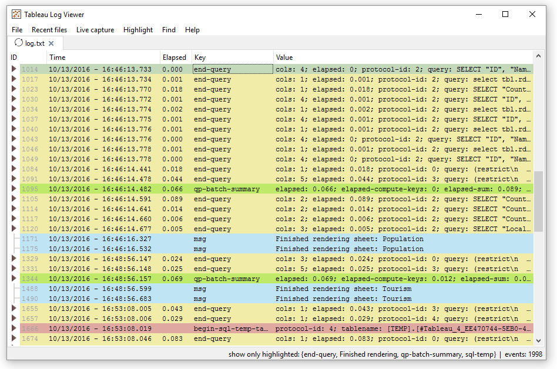
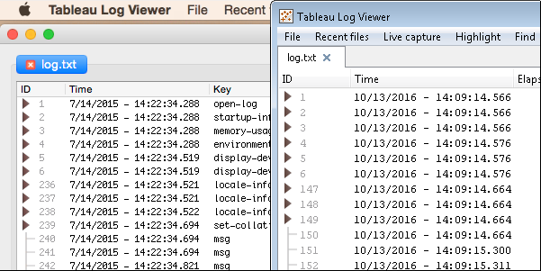
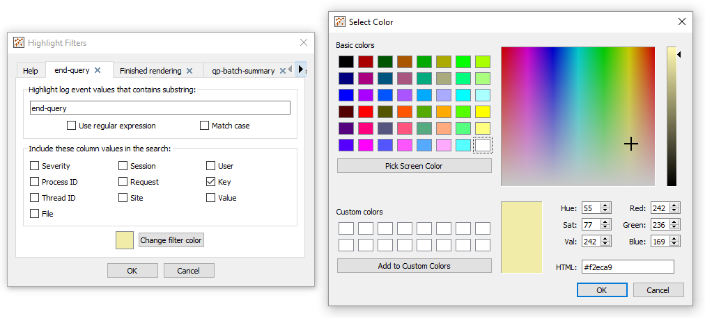
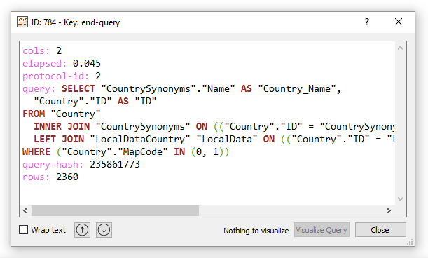
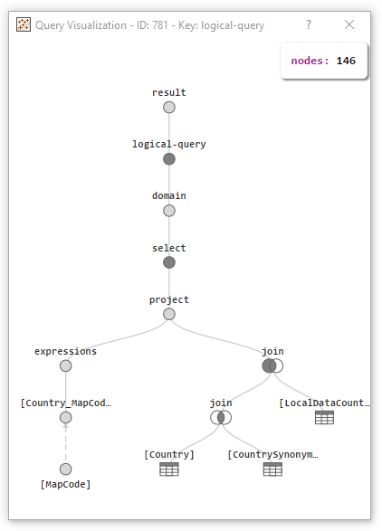

# Tableau Log Viewer

Tableau Log Viewer is cross-platform tool with a simple interface that has a single purpose of making it easy to quickly glance over Tableau log files.



Overview
---------------
* Tableau log file representation in easy to read columnar format
* Advanced event search and highlighting
* Query syntax highlighting
* Live capture: events appear as they happen
* Supported on Windows and Mac (and can be built on Linux)

### How do I get started with Tableau Log Viewer?
Simply launch the application and drag'n'drop Tableau's log file. Both Tableau Desktop and [most] Tableau Server log files are supported. More detailed information can be found on [wiki](https://github.com/tableau/tableau-log-viewer/wiki)

### Where does Tableau save the logs?
Tableau Desktop stores the logs in the "Logs" subfolder under "My Tableau Repository". Examples:
- On Windows: C:\Users\<user>\Documents\My Tableau Repository\Logs\
- On Mac: Example: ~/Documents/My Tableau Repository/Logs

Features
---------------
### Cross platform
Tableau Log Viewer is build using Qt. The application works on both Windows and Mac OS X.



### Live Capture
Monitor the events happening in Tableau as they happen. There are different options to start a live capture:
- Toggle Live Capture on the current file
- Enable Live Capture on a entire folder
- Shortcuts to enable live capture on common files and directories under "My Tableau Repository"

### Recent files
Keeps track of recently opened files, and allows you to clear the history list.

### Find
Search and find events by looking at their keys, values, session, etc.
Use F3 and Shift+F3 to go through all the found events quickly.

### Highlight filters
Highlight events that have certain characteristics. The colors default to a predefined palette, but they can be overridden.
TLV can have many highlight filters. Newer filters (further right) have a higher priority.



#### Highlight only mode
Only keep the events that are highlighted and filter out the rest. Available in Menu->Highlight->Highlight only mode; or by pressing Ctrl+J (Windows) or Cmd+J (Mac).

#### Save and load filters
Save a set of highlight filters so you can restore them later in another session of Tableau Log Viewer.
These options are available under the Highlight menu. 

#### Default hightlight filter
Automatically load a given hightlight filter on new windows and tabs of Tableau Log Viewer.
This option is available under Menu->Help->Options.

### SQL Syntax Highlighter
When opening events with queries, TLV will highlight the SQL queries to make them easier to read.



### Query Visualization
See queries in a tree visualization. Query visualizations are available for the following events:
- All logical-query events
- All logical-query-rewrite events
- For begin-query and end-query events that issue query function trees (like the ones generated when connected to Tableau Server).

To launch a query visualization, open one of those events and you will notice that the "Visualize query" button is enabled. When you press it, the visualizer will open:



To see logical-query events in the logs, you need to launch Tableau with the following Tableau parameter: -DLogDetail=LogicalQueryXML
On Windows do:
```
tableau.exe -DLogDetail=LogicalQueryXML
```
On Mac, you will need to launch Tableau like this:
```
open -a Tableau.app --args -DLogDetail=LogicalQueryXML
```

Is Tableau Log Viewer supported?
---------------
Tableau Log Viewer is made available AS-IS with no support. This is intended to be a self service tool and includes a user guide. Any requests or issues discovered should be filed in the [Issue Tracker](https://github.com/tableau/tableau-log-viewer/issues)

How can I contribute to Tableau Log Viewer?
---------------
Code contributions & improvements by the community are welcomed & encouraged! See the [LICENSE](https://github.com/tableau/TableauLogViewer/blob/master/LICENSE) file for current open-source licensing & use information.